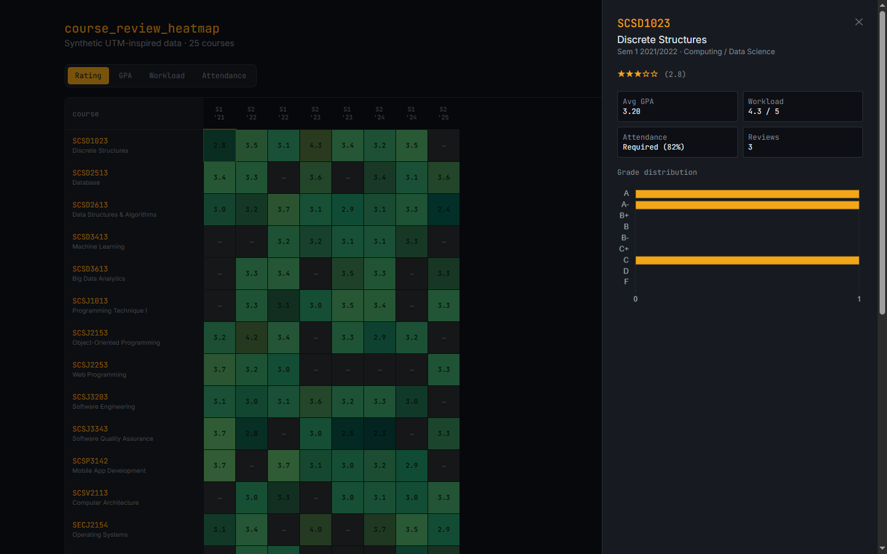

# Course Review Heatmap

A dense, terminal-style heatmap of course reputation — **professor rating, GPA, workload, and
attendance** — across ~25 Malaysian-university courses and 8 semesters. Students read aggregated
reputation at a glance and submit their own reviews.

**Live demo:** _(deploying — link coming)_

## Stack

React (Vite) · Tailwind v4 (OKLCH) · Zustand · Supabase (Postgres + RLS) · Chart.js · Vercel

## How it works

- The heatmap reads an aggregated Postgres **view** (`course_semester_stats`); the detail drawer
  reads the underlying `reviews` rows for a Chart.js grade-distribution chart.
- Submissions `INSERT` into `reviews`, validated **both** client-side and by database **CHECK
  constraints**, and governed by **Row Level Security**: anonymous read + constrained insert, with
  **no** update or delete. (Verified: a valid insert is allowed and the view recomputes; an
  out-of-range insert, an update, and a delete are all denied to the anon role.)
- Heat colors use a **colorblind-safe sequential OKLCH ramp** (monotonic in lightness, not
  red→green), and **every cell prints its value** — so the encoding never relies on color alone.
  Low-sample cells are dimmed so they don't read as authoritative as well-reviewed ones.

## Data & limitations (honest notes)

- Data is **synthetic / UTM-inspired** — not real enrollment advice.
- Submissions are **anonymous and unmoderated** (no auth) — a deliberate MVP scope choice.
- The Supabase free tier may pause the project after ~7 days of inactivity; if the demo looks
  empty, it's waking up — reload after a moment.

## Local setup

1. `npm install`
2. Copy `.env.example` → `.env` and fill `VITE_SUPABASE_URL` and `VITE_SUPABASE_ANON_KEY`.
3. Run `supabase/schema.sql` in your Supabase SQL editor (creates tables, the stats view, and RLS).
4. Seed: add `SUPABASE_SERVICE_ROLE_KEY` to `.env`, then `node supabase/seed.mjs`.
5. `npm run dev`

## Tests

`npm test` — Vitest unit tests cover the pure logic (metric definitions, the OKLCH color scale,
review validation, the Zustand store) and the key components (heatmap cell, metric switcher, grade
bucketing, submission validation).
